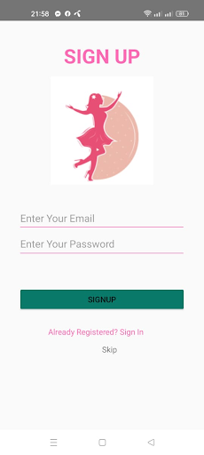
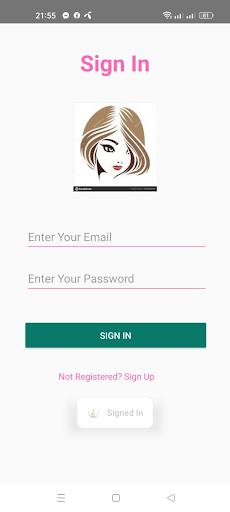
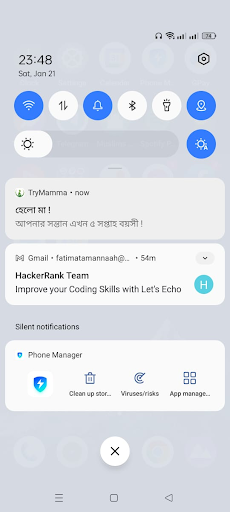
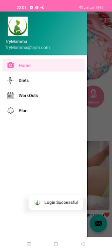
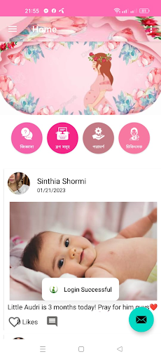
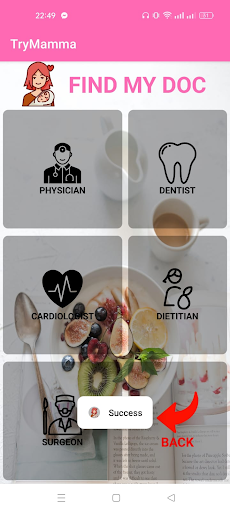
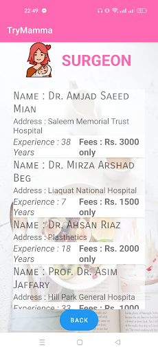

# Pregancy care and Disease Detection

## Overview
This is an Android application designed to improve maternal and fetal health for Bangladeshi women. Leveraging mobile health technologies (mHealth) and evidence-based clinical insights, it provides:

- Personalized diet and workout plans per gestational stage
- Symptom-based disease prediction and healthcare guidance
- Vaccination reminders and medication tracking
- Community support and expert doctor consultations
- Gestational tracking with 3D fetal visualization

This app also integrates AI-ready data collection for potential predictive analytics in maternal health, making it relevant for research in AI, healthcare, and smart applications.

---

## Features

| Module      | Features                                                                                   |
|------------|--------------------------------------------------------------------------------------------|
| Home       | Jiggyasha (Q&A), Blog (community posts), Poramorsho (doctor posts), Chikitsak (direct consultations), 3D fetal visualization |
| Diet       | Food charts by trimester, daily intake tracking, nutrition deficiency alerts               |
| Workouts   | Short, trimester-based exercise videos                                                     |
| Health Tracker | Input symptoms for disease risk prediction, store vitals, generate analytics for doctors |
| Plan       | Gestational tracker with notifications, reminders for meds & doctor visits                |
| Community  | Share experiences, receive expert suggestions, peer support                                |

---

## Technical Stack
- **Platform:** Android  
- **Language:** Java (OOP, Android SDK)  
- **Database:** Firebase Realtime Database  
- **IDE:** Android Studio  
- **Device Tested:** Realme 9 5G  
- **Methodology:** Agile SDLC  
- **Libraries & Tools:** Android APIs, C/C++ libraries (graphics & media), Dalvik/ART runtime  

**Potential AI/ML Integration:**
- Symptom-based disease prediction module can integrate machine learning models to predict high-risk conditions.
- User health data can feed AI models for nutrition, exercise, and early warning analytics.

---

## Methodology
Development followed the Software Development Life Cycle (SDLC) with Agile principles:

1. **Planning:** Surveyed existing pregnancy apps, identified gaps for Bangladeshi users.  
2. **Wireframing:** Developed taxonomy of problems from user comments & expert inputs.  
3. **Design:** Collected feedback from 5 physical therapists, 3 IT experts, and 15 pregnant users.  
4. **Prototyping:** Built functional UI/UX prototype to ensure usability.  
5. **Testing & Deployment:** Iterative feedback loops, usability testing, and error prevention.

**Flowchart of App System:**

User Input → Health Tracker → Disease Prediction → Doctor Suggestion
↓
Diet & Workout Plans → Notifications & Reminders
↓
Community Interaction → Expert & Peer Support

---

## Outcomes & Analysis
- Immediate access to essential health information  
- Faster doctor consultations and follow-ups  
- Improved maternal & fetal health monitoring  
- Early detection of diseases through symptom analysis  
- Reduced maternal & infant mortality and morbidity  
- Strong potential for AI-driven predictive analytics in maternal healthcare research  

---

## Screenshots / Prototype
- **Home Screen:** Questions (Jiggyasha), Blog, Doctor Suggestions (Poramorsho), Direct Consult (Chikitsak)  
- **Diet Module:** Food charts by trimester, daily nutrition tracking  
- **Workouts:** Short exercise videos tailored to pregnancy stage  
- **Plan Module:** Gestational tracker with reminders  
- **Health Tracker:** Symptom input → Disease risk prediction → Doctor suggestions  

  
  
  

  
  
  

  
  
  

---

## Future Enhancements
- Integrate AI/ML models for predictive maternal health analytics  
- Add personalized notifications using reinforcement learning  
- Expand community module with sentiment analysis to detect urgent cases  
- Multi-language support for regional dialects in Bangladesh  
- Incorporate wearable device integration for continuous monitoring  

---

## References
- American College of Obstetricians and Gynaecologists, 2010, p. 241  
- Android Developer Documentation  
- Research2Guidance, mHealth App Developer Economics Study, 2017  
- Chaudhry B.M., Faust L., Chawla, N.V., Design to Evaluation of Pregnancy App for Low-Income Women  
- Stanford Children’s Health – Fetal Monitoring  
- What to Expect – Week-by-Week Pregnancy Guide  

---
## Link to app
https://apkpure.com/group/com.example.justknow

## See the app in action 
https://youtu.be/Dl-RAuIGv2M?si=CotU3AekN7JBZVsL

---

## License
This project is for **academic and research purposes only**. Contact the author for commercial usage.

**Author:** Fatema Ferdous Tamanna, BSc CSE, Patuakhali Science and Technology University
